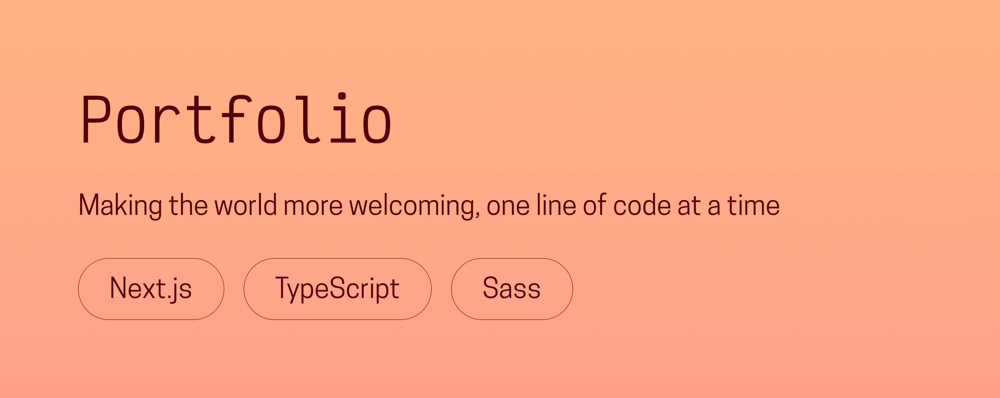

# 💻 chloeadrian.dev

**My personal portfolio, designed and developed from scratch to showcase my work as a front-end developer.**  
Built with Next.js, TypeScript, and Sass.

---

## 🌟 Overview
This is the latest version of [**chloeadrian.dev**](https://chloeadrian.dev). The goal was to create something that feels **personal yet professional**, with a focus on **clarity, accessibility, and thoughtful motion**.  

Every page was built to reflect who I am as a developer: someone who values usability, detail, and a touch of creativity.

---

## 🖥️ Live website
👉 [**Visit chloeadrian.dev**](https://chloeadrian.dev)

---

## ⚙️ Tech stack
- **Next.js** for fast, scalable page rendering  
- **TypeScript** for reliable, maintainable code  
- **Sass** for organized styling and design system control  
- **Framer Motion** for subtle, meaningful animations  
- **Figma** for layout and visual design  

---

## 🧠 Key features
- Bilingual support (English 🇬🇧 / French 🇫🇷)  
- Accessible interface with keyboard navigation and clear focus states  
- Custom project cards with hover animations and filter-free navigation  
- Fully responsive layout across devices  
- Focus on performance, typography, and consistency  

---

## 🕊️ Reflection
This portfolio is more than just a collection of projects, it’s a place to showcase my growth as a developer and designer.  
It represents how I approach front-end development: **as a bridge between technology, design, and communication**.  

Every line of code here reflects what I love most about the web: creating experiences that are human, inclusive, and visually satisfying.

---

Thanks for visiting, and enjoy exploring my universe!  
Chloé Adrian ✨